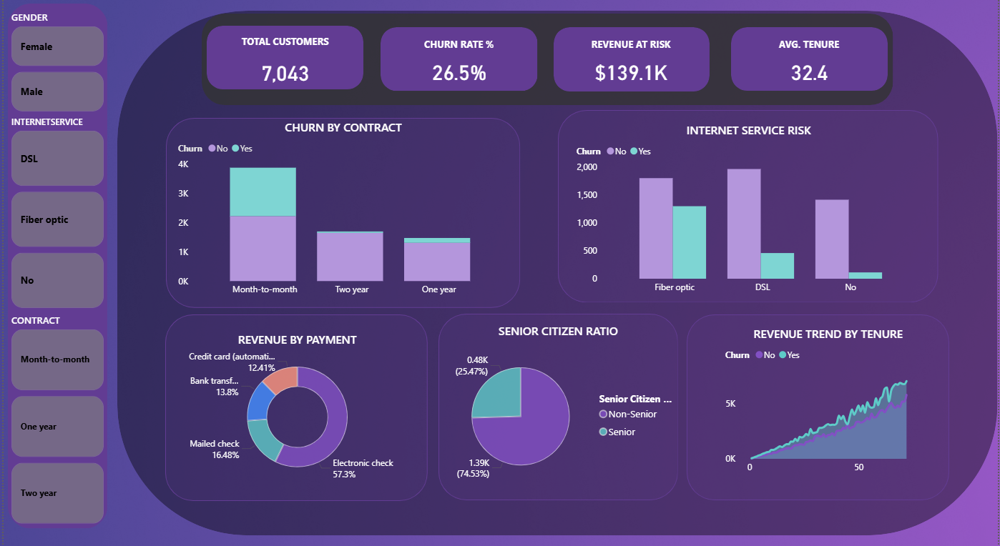

# 📊 FUTURE_DS_02 – Customer Churn Analysis Dashboard

## 📌 Project Overview
**FUTURE_DS_02** is a comprehensive data analytics project. The objective was to investigate customer attrition (churn) patterns within a telecommunications dataset.

---

## 📈 Key Business Insights
* **Contractual Risk:** Month-to-Month contracts represent the highest churn density.
* **Service Vulnerability:** Fiber Optic users exhibit a higher churn rate.
* **Revenue at Risk:** Identified ~$139.1K in monthly revenue held by churn-prone customers.

---

## 🧹 Data Preparation & Analysis
* **Data Cleaning:** Processed the Telco dataset using Power Query to handle categorical mapping.
* **Calculated Fields:** Developed custom metrics including **Churn Rate %** and **Revenue at Risk**.

---

## 🖼️ Dashboard Preview & Demo

### 📸 Static Preview

---

## 🛠️ Tools Used
* **Power BI Desktop**
* **Git & GitHub**

---

## 🚀 Conclusion
This project successfully bridges the gap between raw data and strategic decision-making by identifying high-value segments and churn trends.